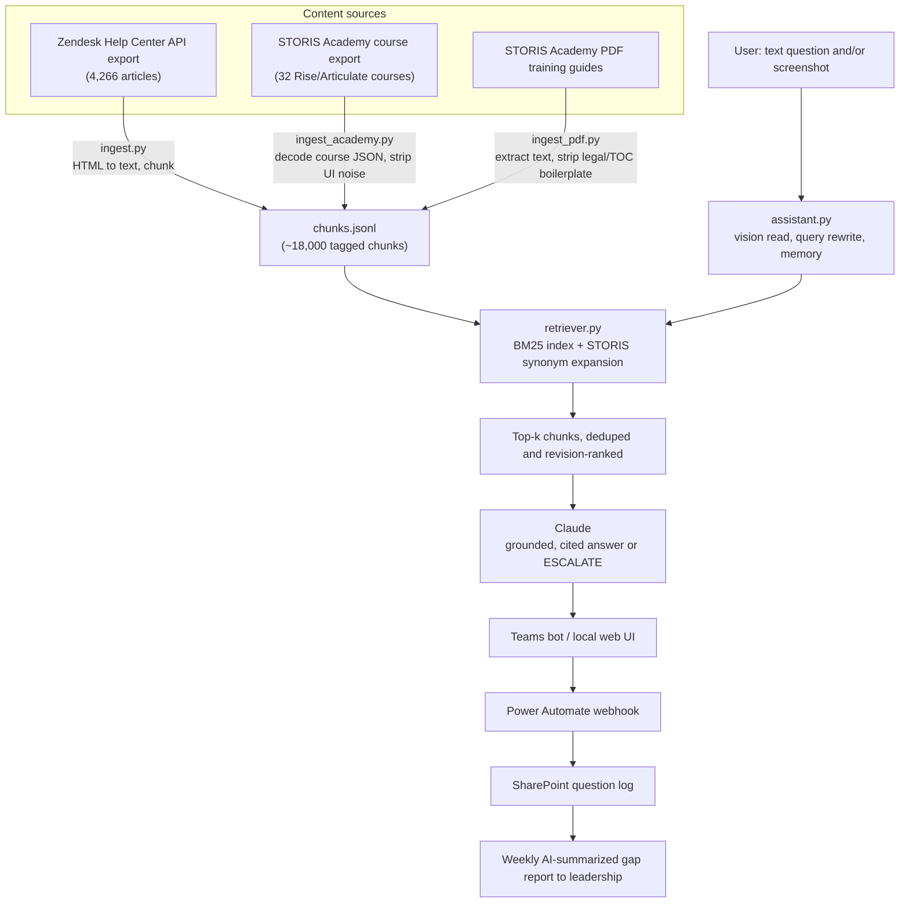

# SCiXus: A Production RAG Assistant for ERP Support

**One-line summary:** SCiXus is a retrieval-augmented chatbot that answers STORIS ERP
how-to and troubleshooting questions for retail staff at 1915 South, deployed live in
Microsoft Teams, grounded in ~18,000 chunks of internal help-desk and training content,
with a closed-loop process for surfacing what it can't answer yet.

> This document describes the system's design, decisions, and results. It does not
> include the underlying corpus, code, or any proprietary STORIS/Zendesk content;
> those remain in a private repository. Numbers below (corpus size, retrieval scores)
> are real, pulled from the system's own stats and eval output.

**Role:** I was the sole architect and engineer on this project end to end, covering problem
scoping, corpus design and ingestion pipelines, retrieval and generation architecture,
Teams/Azure deployment, and ongoing maintenance and iteration since launch.

## The problem

STORIS is the ERP system 1915 South's retail staff use to run sales, service, and
inventory. The documentation for it, thousands of Zendesk help articles plus a
separate Academy training platform, is comprehensive but not something a busy
sales associate is going to search through mid-transaction. The result: repeated
interruptions to managers and power users for the same handful of "how do I..."
questions, and slower onboarding for new hires, especially with STORIS NextGen
(a newer interface) rolling out alongside the traditional one.

## What it does

- Answers "how do I write a sale," "how do I process a return," etc. in plain
  language, grounded in and citing the actual STORIS documentation.
- Reads screenshots: a user can paste a picture of the screen they're stuck on,
  and the bot identifies the screen, reads visible fields/errors, and adjusts its
  guidance accordingly.
- Holds a real conversation. Follow-ups like "I don't see that, I only have the
  customer fields" are understood in context, not treated as a fresh query.
- Knows when it doesn't know. When the docs don't cover a situation, it says so
  and hands off to a human rather than guessing, and that handoff is itself a
  signal that feeds a content-improvement loop (see below).
- Lives in Microsoft Teams, where staff already work.

## Architecture



The system is intentionally simple end to end: no vector database, no message
queue, no separate services beyond the bot process itself. Everything in the
retrieval and generation path runs in one Python process.

## Key technical decisions and tradeoffs

**Retrieval: BM25 + a hand-built synonym layer, not embeddings.**
The retriever (`retriever.py`) is pure lexical search: `rank_bm25`'s BM25Okapi
over tokenized chunks, plus a small dictionary that maps how staff actually talk
("write a sale," "ring up," "layaway") to the vocabulary the docs use ("Enter a
Sales Order," "point of sale," "deposit"). This was a deliberate choice for a
v1: zero infrastructure, zero per-query API cost, deterministic and fully
explainable ranking, and no embedding model to select, host, or version. The
tradeoff is explicit and documented in the code: BM25 misses genuine vocabulary
gaps a synonym entry hasn't anticipated ("add a new customer" was a known miss
in the eval set), and BM25 scores are not a calibrated confidence signal. A
correct top hit and an irrelevant one can score in an unpredictable range
relative to each other, which matters for the escalation design below. The
upgrade path (swap the scorer for embedding similarity, or run both as a hybrid)
is designed in from the start: `retrieve()` has a stable interface so the rest
of the system doesn't change when that swap happens.

**Chunking: paragraph-block packing to ~1,500 characters with ~150–200 character overlap.**
Rather than fixed-token windows, chunks are built by greedily packing whole
paragraph blocks up to a character budget, carrying a tail of the previous
chunk forward as overlap. This keeps chunks aligned to natural document
structure (a chunk rarely splits a numbered step list mid-stream) instead of
cutting at an arbitrary token boundary, at the cost of some chunk-size variance.

**Revision handling instead of deduplication.**
STORIS documentation carries near-duplicate articles across ERP versions:
1,986 titles exist in both the outgoing "10.7" doc set and the current
"10.8/11.0" set. Rather than deleting the older version (which would lose
version-specific detail some users still need), the retriever down-weights
10.7-tagged chunks by a fixed factor and dedupes by normalized title at
result-composition time, so the current-revision article wins ties without the
old one being unavailable entirely.

**Escalation is model-judged, not score-gated, and that's a known compromise.**
Because BM25 scores aren't calibrated, escalation ("I can't resolve this, here's
a human to ask") is driven by asking Claude to emit a literal `<ESCALATE>` tag
when the retrieved context genuinely doesn't cover the situation, rather than by
thresholding retrieval scores. This is more robust than a score cutoff would
have been, but it means confidence is implicit in the model's judgment rather
than a number you can tune or audit. The code comments call this out directly
as something embeddings would improve (a real cosine-similarity floor would be
a calibrated "no good match" signal retrieval scores currently can't provide).

**Source-specific ingestion, not a single pipeline.**
Three sources meant three cleaning problems: Zendesk gives clean-ish HTML
(`ingest.py` strips tags, promotes headings/list markers to Markdown-like
text). STORIS Academy's Rise-based courses ship their content as base64-encoded
JSON inside a JSONP callback in a locale file (`ingest_academy.py` decodes it
and walks the tree for actual lesson text, filtering out UI chrome like
"Continue," "Correct," "Knowledge Check" that isn't real content). The
downloadable PDF training guides needed boilerplate stripping for repeated
confidentiality banners, page numbers, and dotted table-of-contents leaders
(`ingest_pdf.py`). Each path tags its output with `source` (zendesk/academy)
and `interface` (ERP/NextGen), which the retriever and the answer-generation
metrics both use.

**Generation: Claude, with a strict grounding instruction.**
Answers come from Claude Haiku by default (fast, cheap; the README notes an
older cost estimate of roughly $0.005/question), with the system prompt
instructing it to answer only from the retrieved articles and never invent
menu names, fields, or steps. Screenshot reading uses the same model by
default but is explicitly overridable (`STORIS_VISION_MODEL`) to a stronger
model, because dense STORIS screens read more reliably with more capability;
this is pinned in the deploy config specifically so a dashboard override
doesn't silently regress screenshot quality across deploys.

**The feedback loop is a product decision, not just an engineering one.**
Every question and every thumbs up/down is POSTed to a webhook that logs into a
SharePoint sheet, which a scheduled Power Automate flow summarizes with AI and
emails to leadership weekly. The single most useful column in that log is a
computed `knowledge_gap` flag (true on escalation or a thumbs-down); it turns
"the bot doesn't know something" from an invisible failure into a visible,
prioritized backlog of exactly what documentation or training content to add
next. That closes the loop between usage and content improvement without
requiring anyone to manually review transcripts.

## Setup and usage (for reference; real corpus not included here)

```bash
pip install -r requirements.txt
python ingest.py storis_kb_corpus.json .   # HTML export -> clean_corpus.jsonl + chunks.jsonl
python ask.py "how do I write a sale"       # CLI, retrieval-only without a key

export ANTHROPIC_API_KEY=sk-...
python app.py                               # local web UI at http://localhost:5000
```

Production runs as a Microsoft Teams bot (Bot Framework / Azure Bot registration)
hosted on Render, with conversation logging into SharePoint via Power Automate.

## Results

- **Corpus:** 4,266 Zendesk help articles (3.15M+ words) plus 32 STORIS Academy
  courses and a PDF training workbook, totaling roughly 18,000 indexed chunks.
- **Retrieval quality:** hit@3 = 92%, hit@1 = 75% on a 12-question hand-built
  smoke test (`eval.py`) covering common staff questions. This is a directional
  check, not a rigorous benchmark; see Limitations.
- **Deployed and in real use** inside Microsoft Teams at 1915 South, answering
  live staff questions with source citations and a working escalation path.

## Limitations and honest gaps

A hiring manager will notice these; better to say them plainly:

- **No automated test suite and no CI.** `eval.py` is a 12-case retrieval smoke
  test, not unit/integration tests, and there's nothing running it on push.
- **The eval set is small and retrieval-only.** It checks whether the right
  article surfaces, not whether the generated answer is correct; there's no
  end-to-end answer-quality eval yet.
- **`corpus_stats.json` is stale.** It reflects the original Zendesk-only
  ingest (17,597 chunks) and was never regenerated after the Academy content
  merge brought the total to ~18,000.
- **BM25 confidence isn't calibrated**, as discussed above, a known,
  documented limitation of the v1 retrieval design, with a clear upgrade path
  already designed into the retriever's interface.
- **Conversation memory is in-process** (`MemoryStorage`), which is fine for a
  single instance but wouldn't survive a restart or scale-out; the team's own
  deploy notes flag Azure Blob/Cosmos DB or Redis as the production-hardening
  step here.
- **No automated corpus refresh.** Content updates require a manual re-export
  and re-run of the ingest scripts; nothing detects when the source docs
  change.

## What's next

- Swap or hybridize BM25 with embedding similarity to close the vocabulary-gap
  misses and get a calibrated confidence signal for escalation.
- Grow the eval set using real logged questions (especially the
  `knowledge_gap` backlog) instead of a fixed 12-question list.
- Add CI (lint + the eval script) and durable conversation storage before
  scaling beyond a single instance.

---

*[TODO: confirm] add a short demo GIF or screenshots of the Teams bot in
action once available; none currently exist outside the live tenant, and I'm
not fabricating a mockup of a real production UI.*
